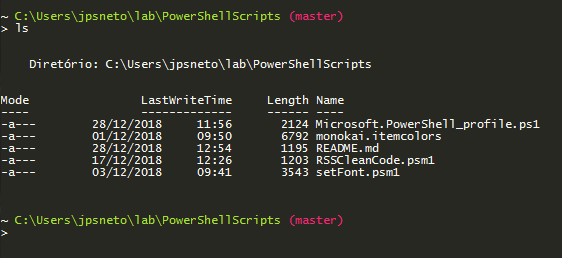

# PowerShell Scripts Utils

Powershell utils scripts pra todos que tem que usar windows na empresa

## Dependências

A unica dependência para os scripts funcionarem é o [colortool](https://github.com/Microsoft/console/tree/master/tools/ColorTool) da microsoft

## Install

Pra instalar é simples, segue o passo a passo

### Preparando o powershell

1. Abra o powershell como administrador 
2. Execute o comando `new-item $profile -itemtype "file"`
3. Execute o outro comando `Set-ExecutionPolicy unrestricted`
4. Abra o arquivo presente em `$profile`, basta o comando `notepad $profile`
5. Copie o conteúdo do arquivo `Microsoft.PowerShell_profile.ps1` para o arquivo aberto
6. Salve e feche o arquivo

### Instalando as Dependencias

1. Crie uma pasta onde os seus programas serão armazenados
2. Mapeie esta pasta nas variaveis de ambiente do windows na variavel `PATH`
3. Coloque os arquivos `setFont.psm1` e `RSSCleanCode.psm1` na pasta criada
4. Coloque o clone do [colortool](https://github.com/Microsoft/console/tree/master/tools/ColorTool) na pasta em questão
5. Adicione o arquivo `monokai.itemcolors` na pasta `schemes` que esta no clone do colortool

## Resultado

